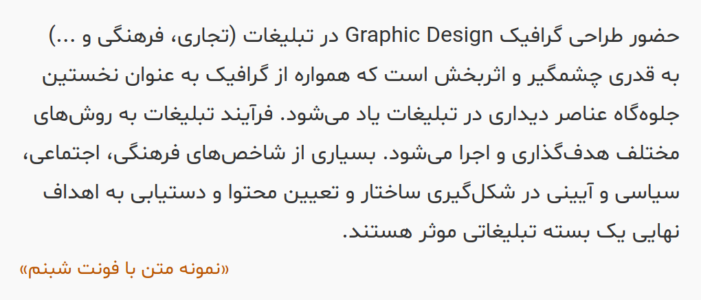

# Shabnam Font
A Persian (Farsi) Font

[](https://www.npmjs.com/package/shabnam-font)

فونت فارسی شبنم  
[نمایش فونت - صفحه رسمی پروژه](https://rastikerdar.github.io/shabnam-font/)  
[صفحه دریافت (دانلود) بسته فونت شامل فایل های ttf,woff,eot](https://github.com/rastikerdar/shabnam-font/releases)  
با تشکر از برنامه [FontForge](https://fontforge.github.io)  
بر مبنای فونت [وزیر](https://rastikerdar.github.io/vazir-font)  
نسخه‌های بدون حروف لاتین یا تمام ارقام فارسی درون بسته فشرده موجود می‌باشد.  
فرآیند تولید بسته نهایی شامل انواع نسخه‌ها و فرمت‌ها توسط ابزار [fontbuilder](https://github.com/rastikerdar/fontbuilder) انجام می‌شود.

## نمونه متن Sample:


## طریقه استفاده در صفحات وب:

<p dir="rtl">
کد زیر را در قسمت style یا فایل css وارد نمایید:
</p>


```css
@font-face {
  font-family: Shabnam;
  src: url('Shabnam.eot');
  src: url('Shabnam.eot?#iefix') format('embedded-opentype'),
       url('Shabnam.woff2') format('woff2'),
       url('Shabnam.woff') format('woff'),
       url('Shabnam.ttf') format('truetype');
  font-weight: normal;
}

@font-face {
  font-family: Shabnam;
  src: url('Shabnam-Bold.eot');
  src: url('Shabnam-Bold.eot?#iefix') format('embedded-opentype'),
       url('Shabnam-Bold.woff2') format('woff2'),
       url('Shabnam-Bold.woff') format('woff'),
       url('Shabnam-Bold.ttf') format('truetype');
  font-weight: bold;
}

@font-face {
  font-family: Shabnam;
  src: url('Shabnam-Thin.eot');
  src: url('Shabnam-Thin.eot?#iefix') format('embedded-opentype'),
       url('Shabnam-Thin.woff2') format('woff2'),
       url('Shabnam-Thin.woff') format('woff'),
       url('Shabnam-Thin.ttf') format('truetype');
  font-weight: 100;
}

@font-face {
  font-family: Shabnam;
  src: url('Shabnam-Light.eot');
  src: url('Shabnam-Light.eot?#iefix') format('embedded-opentype'),
       url('Shabnam-Light.woff2') format('woff2'),
       url('Shabnam-Light.woff') format('woff'),
       url('Shabnam-Light.ttf') format('truetype');
  font-weight: 300;
}

@font-face {
  font-family: Shabnam;
  src: url('Shabnam-Medium.eot');
  src: url('Shabnam-Medium.eot?#iefix') format('embedded-opentype'),
       url('Shabnam-Medium.woff2') format('woff2'),
       url('Shabnam-Medium.woff') format('woff'),
       url('Shabnam-Medium.ttf') format('truetype');
  font-weight: 500;
}
```

## Install

Grab the [latest release](https://github.com/rastikerdar/shabnam-font/releases/latest) file.

#### bower

```
bower install shabnam-font --save
```

#### npm
```
npm install shabnam-font --save
```

#### yarn
```
yarn add shabnam-font --save
```

Fonts will be copied to `npm_modules/shabnam-font/dist` directory

Or [RawGit](https://rawgit.com) CDN:

```html
<link href="https://cdn.rawgit.com/rastikerdar/shabnam-font/v[X.Y.Z]/dist/font-face.css" rel="stylesheet" type="text/css" />
```

Replace [X.Y.Z] with the latest version (e.g. 5.0.1) and integrate the font into your CSS:

```
font-family: 'Shabnam', sans-serif;
```

#### Arch Linux

Arch user's could use [shabnam-fonts](https://aur.archlinux.org/packages/shabnam-fonts/) package from [AUR](https://aur.archlinux.org/) repository to install shabnam font. Use your favourite [AUR helper](https://wiki.archlinux.org/index.php/AUR_helpers) like pacaur or yaourt for installing package:

```shell
pacaur -S shabnam-fonts
```
